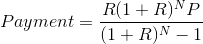
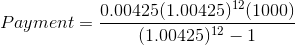

# Introductiong to Computer Science - Fall 2018

# Lab 9 - One way or another, you're going to pay

**Functions as abstractions:** this lab gives you a chance to practice defining and calling a function. In this lab, you will write a function that computes how much a payment is on a loan, given the term, interest rate, and initial loan amount. A skeleton of the program is already created and attached to this repository.

**Discussion:** In what follows, notice how things are named so that we have some idea of what variable names to use.

The formula for computing the monthly payments on a loan of P dollars at a given annual percentage rate(APR) for N months is:

where `R = APR/1200`, the monthly interest rate in computational form. The monthly payment assumes that interest is compounded monthly on the unpaid balance. Consider the following example in which $1000 is borrowed at 5.1% annual interest rate for 12 months.

`P = 1000 APR`, `APR = 5.1`, `N = 12`

`R = APR / 1200 = 5.1 / 1200 = .00425`

which is $86.65 when rounded to the nearest penny. You can check the calculations by using a calculator. Your calculations may produce a number that is slightly different than 85.65 due to round-off error in the calculations.

**The Payment Function:** Code a Python function named `payment()` that will calculate the monthly payment for a loan using the formula described above. The function must have 3 parameters: the principal amount of the loan, the annual percentage rate of interest, and the number of months payments will be made. The function must return the payment amount and be separate from the `main()` method.

Here are few hints. Look at the source code for the diagonals program in the course materials (courtesy Marty J. Wolf). This is a great opportunity to practice the problem solving technique of dividing the problem into subproblems. Look for ways to compute small parts of the formula above. To raise a number to a power, use the standard Python \*\* operator. For example, `2.5**8` will calculate and return the value of 2.58 = 1525.87890625. In general, `x**k` calculates and returns xk (x raised to the kth power).

Your `payment()` function should be inserted into the `loan.py` file at the place indicated by the comments. Remove the comment and put your function in its place. You also need to un-comment the statements in the `calculate_payment()` function that displays the payment amount and total interest. That is remove the `#` symbols.

Once you have completed the assignment, push your edited copy of the repository back to your master branch.
